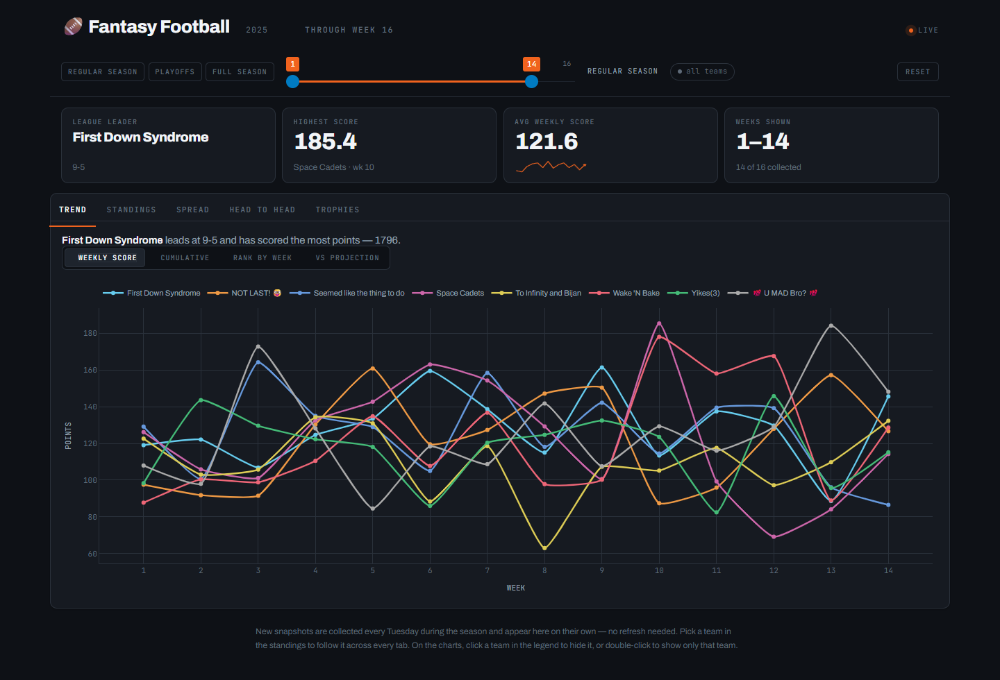
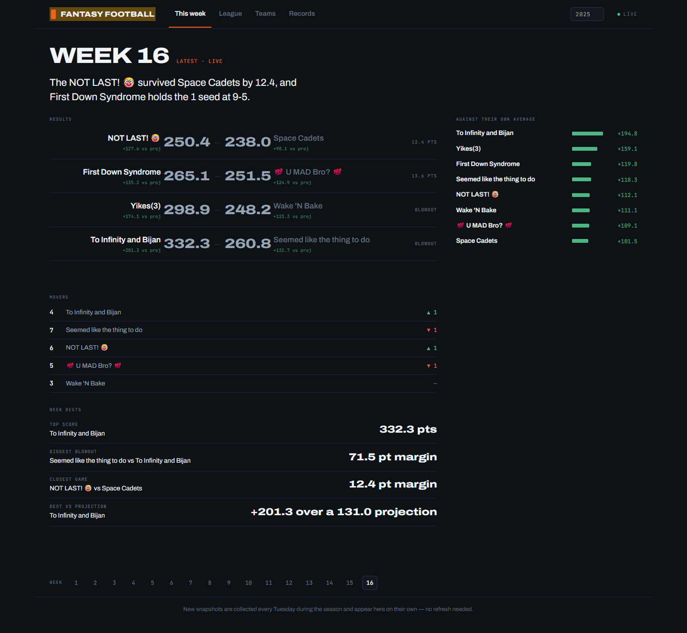
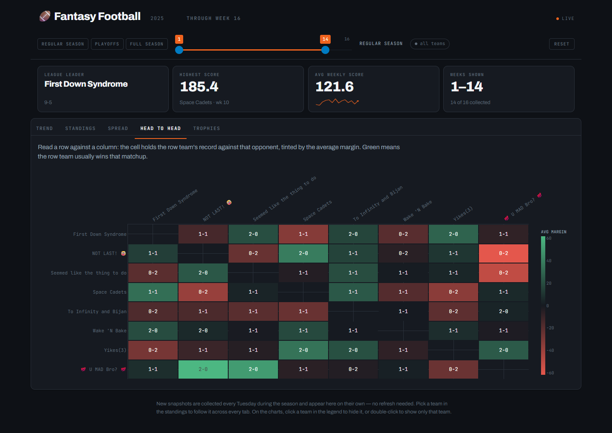
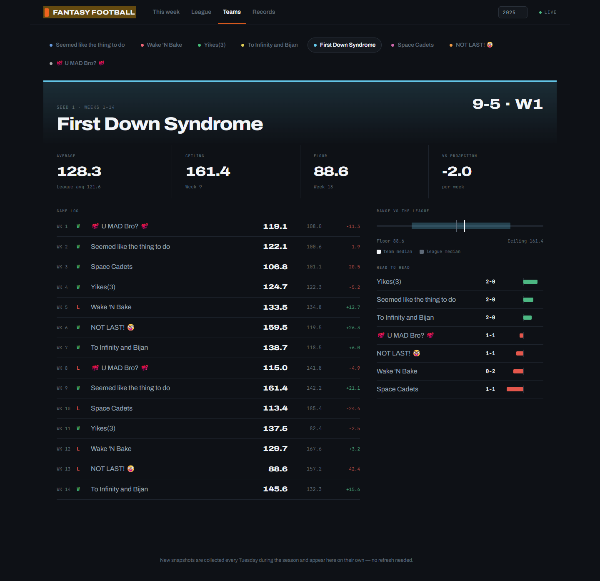
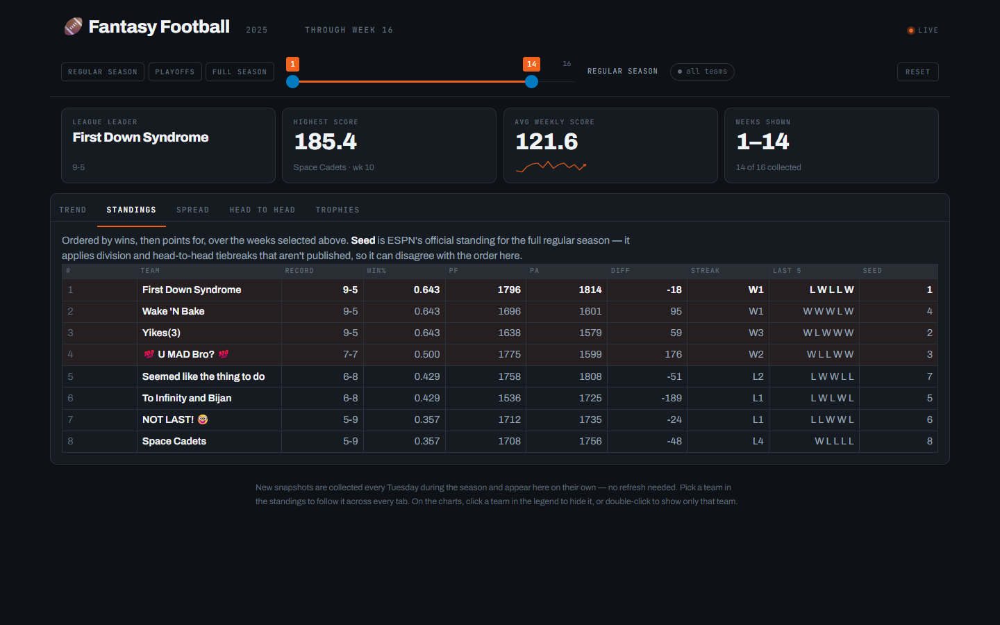
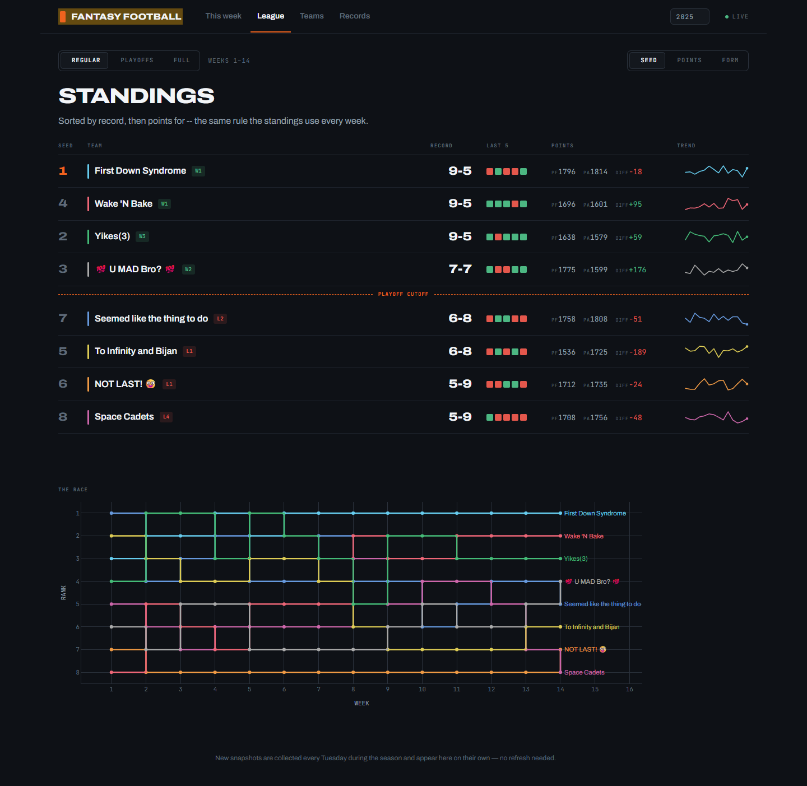
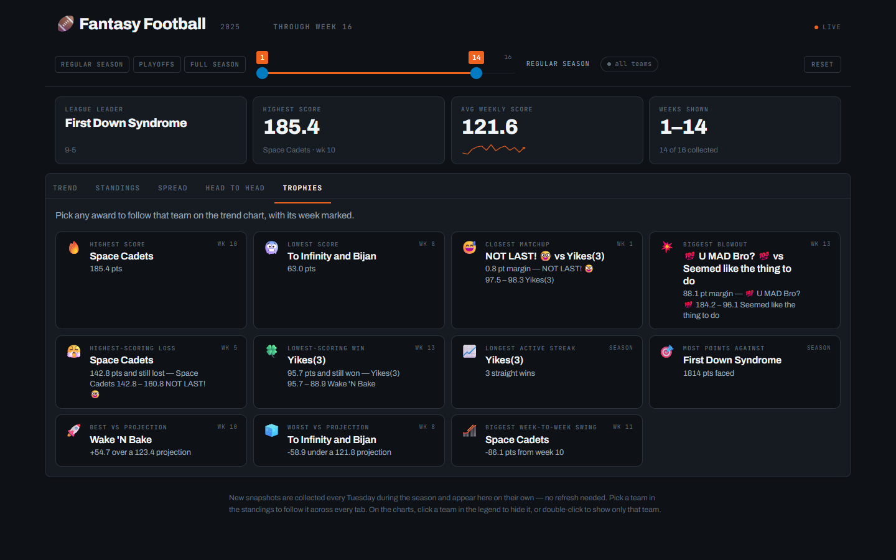
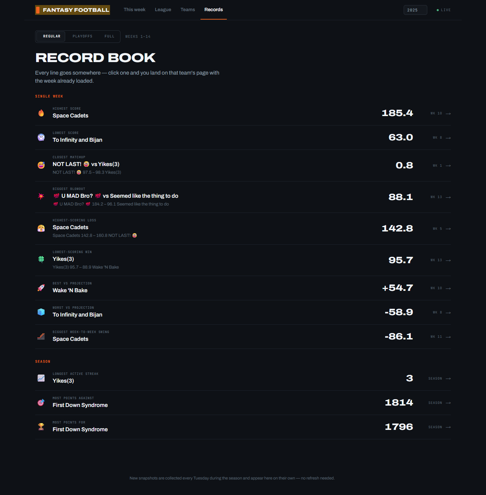
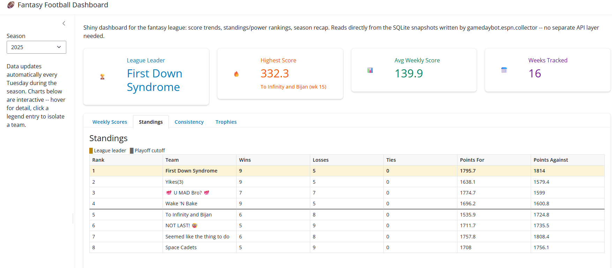

::: {.hero}
::: {.kicker}
ESPN fantasy football
:::

# League updates in Discord. The season on a dashboard.

::: {.lede}
One Docker container posts ESPN reports on a schedule, answers slash commands, and serves a web dashboard of league history.
:::
:::

::: {.trio}
::: {#scheduled}

::: {.num}
Channel
:::

### Scheduled posts

Reports land in the Discord channel that owns the webhook. Jobs run only between `START_DATE` and `END_DATE`.

:::

::: {#commands}

::: {.num}
On demand
:::

### Slash commands

If `DISCORD_BOT_TOKEN` is set, anyone in the server can ask for the current week. The bot syncs its command tree when it connects.

:::

::: {#dash}

::: {.num}
The season
:::

### Web dashboard

A Tuesday snapshot writes the finished week to SQLite. The dashboard charts every season stored in that file.

:::
:::

## A typical week

The scheduler follows the NFL game clock for some jobs. Those times stay on Eastern. All other times follow `TIMEZONE`.

:::: {.week}

::: {.day}
::: {.day-name}
Mon
:::

::: {.slot}
::: {.when}
9:00 AM
:::
::: {.what}
Score update
:::
:::

::: {.slot}
::: {.when}
6:30 PM ET
:::
::: {.what}
Close scores
:::
:::
:::

::: {.day}
::: {.day-name}
Tue
:::

::: {.slot}
::: {.when}
6:00 AM ET
:::
::: {.what}
Dashboard snapshot
:::
:::

::: {.slot}
::: {.when}
9:00 AM
:::
::: {.what}
Finals and trophies
:::
:::

::: {.slot}
::: {.when}
6:30 PM
:::
::: {.what}
Power rankings
:::
:::
:::

::: {.day}
::: {.day-name}
Wed
:::

::: {.slot}
::: {.when}
9:00 AM
:::
::: {.what}
Standings
:::
:::

::: {.slot}
::: {.when}
9:01 AM
:::
::: {.what}
Waiver report
:::
:::
:::

::: {.day}
::: {.day-name}
Thu
:::

::: {.slot}
::: {.when}
7:30 PM ET
:::
::: {.what}
Matchups
:::
:::
:::

::: {.day}
::: {.day-name}
Fri
:::

::: {.slot}
::: {.when}
9:00 AM
:::
::: {.what}
Score update
:::
:::
:::

::: {.day}
::: {.day-name}
Sun
:::

::: {.slot}
::: {.when}
9:00 AM
:::
::: {.what}
Injury monitor
:::
:::

::: {.slot}
::: {.when}
4:00 / 8:00 PM ET
:::
::: {.what}
Score updates
:::
:::
:::

::::

::: {.note}
Set `DAILY_WAIVER` to `True` to post the waiver report every day at 9:01 AM, not only Wednesday. The Tuesday snapshot waits until Monday night football is final. A trade check also runs every hour, every day: each trade is announced once, within the hour it clears.
:::

## Slash commands

Slash commands need `DISCORD_BOT_TOKEN`. If ESPN returns an error, the bot explains that the season may not have started yet.

| Command | Returns |
| --- | --- |
| `/matchups` | The current week's matchups. |
| `/scoreboard` | The current scoreboard. |
| `/standings` | The current standings. |
| `/power-rankings` | The current power rankings. |
| `/monitor` | The injury and player monitor report. |
| `/trophies` | This week's trophies. |
| `/waiver-report` | Recent waiver moves. Private leagues only. |
| `/dashboard` | A link to the web dashboard. |

## Dashboard

The dashboard reads `data/fantasy.db`. It does not call ESPN on its own. It opens on This week, the latest collected week for the season. League and Records carry a scope segment — Regular, Playoffs, or Full — that sets which weeks are in play. The regular-season boundary comes from the data. A team's wins plus losses plus ties is how many games it has played.

:::: {.tabs}

::: {.tab}
### This week

Results ordered closest-first, who moved in the standings, the week's bests, and every team against its own average. Nothing to configure.
:::

::: {.tab}
### League

The standings board — record, streak, last-five form, points for/against, and a sparkline per row — sortable by seed, points, or recent form. Below it, the head-to-head grid, the season's trade ledger, and "the race": rank by week for every team on one chart.
:::

::: {.tab}
### Teams

One page per team: a game log, range vs the league (floor, ceiling, and median next to the league's), and every head-to-head matchup for that team, sorted by average margin.
:::

::: {.tab}
### Records

The record book. Twelve season awards, each a row with its scoreline and week, that links straight to the team it belongs to.
:::

::::

Selecting a team — a standings row, a matchup, a record-book row, or the team picker itself — takes you to that team's own page rather than filtering a shared chart. The dashboard has no reset button because there is nothing left to un-filter: each destination shows the whole league, or one team, never a muted version of either.

A dropdown in the masthead selects the season. Only seasons in the database appear there. The page polls the database every 30 seconds, so a new snapshot reaches an open tab on its own, advancing This week's default view along with it.

Reach the dashboard at http://localhost:8000 locally, or at https://fantasy.ethandbard.com/.

## Before and after

The dashboard has gone through three shapes. The first version proved the
idea — one SQLite file, four stat boxes, four tabs, Bootstrap defaults. It
grew into a five-tab dark build with a shared week-range slider. The redesign
below restructures that build into four destinations, without changing a
single number underneath it.

::: {.compare}
::: {.before}


Before — Trend
:::

::: {.after}


After — This week
:::
:::

::: {.compare}
::: {.before}


Before — Head to head
:::

::: {.after}


After — Teams
:::
:::

::: {.compare}
::: {.before}


Before — Standings
:::

::: {.after}


After — League
:::
:::

::: {.compare}
::: {.before}


Before — Trophies
:::

::: {.after}


After — Records
:::
:::

The very first version, for scale:

::: {.origin-figure}

:::

## How it runs

The entrypoint `gamedaybot/run.py` starts three parts in one process:

```{mermaid}
flowchart LR
  ESPN["ESPN API"] --> Bot["fantasy-bot container"]
  Bot --> Hook["Discord webhook"]
  Bot --> Slash["Slash-command bot"]
  Bot --> DB["SQLite in data/"]
  DB --> Dash["Shiny dashboard :8000"]
  Dash --> Tunnel["Cloudflare Tunnel"]
```

- A scheduler posts recurring reports to a Discord webhook.
- A Discord gateway bot answers slash commands, if `DISCORD_BOT_TOKEN` is set.
- A Shiny dashboard on port `8000`, backed by SQLite in `data/`.

A Cloudflare tunnel publishes the dashboard. On the VPS that is the shared connector on the `edge` network. Off the VPS it is an optional `cloudflared` sidecar with its own tunnel credentials. `DASHBOARD_URL` in `config.env` is the link `/dashboard` returns.

Secrets stay in `config.env`. Docker Compose loads them through `env_file`, so no secret is baked into the image.

## Where the code lives

| Path | Role |
| --- | --- |
| `gamedaybot/run.py` | Container entrypoint. |
| `gamedaybot/espn/` | ESPN access, report text, and the scheduler. |
| `gamedaybot/discord_bot/` | Slash commands, webhook client, and embeds. |
| `gamedaybot/storage/db.py` | SQLite schema and queries. |
| `gamedaybot/web/` | Dashboard layout, season math, and charts. |
| `dev/` | API health check and season backfill. |
| `tests/` | Tests for `web/stats.py`. |
| `docs/` | This overview, the slide deck, and the docs Worker. |

The [README](https://github.com/ethandbard/fantasy-football#readme) covers configuration, Docker setup, tunnel setup, and troubleshooting. This page is the public overview. The [slide deck](slides.qmd) is a shorter walkthrough of the same three parts.

## Preview and publish this site

The overview and slides are a Quarto website in `docs/`.

Preview:

```bash
quarto preview docs
```

Render:

```bash
quarto render docs
```

Output lands in `docs/_site`. Two public URLs serve that folder:

| URL | How it is served |
| --- | --- |
| https://ethandbard.github.io/fantasy-football/ | GitHub Pages, from the `gh-pages` branch |
| https://fantasy-docs.ethandbard.com/ | A Cloudflare Worker that fetches the GitHub Pages copy |

Push to `main` to publish content. The workflow in `.github/workflows/quarto-publish.yml` renders `docs/` and deploys `docs/_site` to `gh-pages`. GitHub Pages serves that branch. The Worker at the custom hostname fetches the same GitHub Pages site. Both URLs then show the new render.

The Worker script is `proxy-worker.js` in this directory. Redeploy it only when that file changes:

```bash
cd docs
npx wrangler deploy
```

A change to the Quarto pages does not need `wrangler deploy`. Push to `main` is enough.

Do not run a second copy of the bot stack on another host at the same time. Two schedulers post every report twice. The docs site has no such limit: it is static files only.
